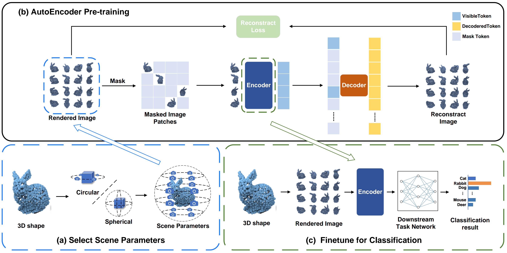

# MVMAE


## Revolutionizing Point Cloud Classification with Multiview Self-Supervised Learning

Self-supervised models are shaping the future of point cloud processing by minimizing reliance on labeled data and addressing the challenges associated with point cloud annotation. Traditional self-supervised point cloud models often employ mask reconstruction, which involves globally dividing patches. This approach can lead to increased computational costs and insufficient consideration of global features. In this paper, we introduce MVMAE, a multiview-based self-supervised model designed for point cloud processing. MVMAE firstly converts point clouds into multiview images through rendering. It then integrates views from various angles as inputs to a mask self-encoder, where each view is treated as a distinct patch. This method provides a more comprehensive perspective for feature learning, enhancing point cloud classification performance. Experiments conducted on datasets like ModelNet40 demonstrate that MVMAE achieves a classification accuracy of 90.1\% and offers improved processing speed while managing computational complexity and parameter count.

### MVMAE deep leaaring network
<p align="center">
  


## 1.Requirements
you need to download extensions at https://github.com/Pang-Yatian/Point-MAE and installed

  -PyTorch >=1.10.1
  -python >=3.7
  -CUDA >= 11.3
  -GCC >=10.5

  ```
  pip install -r requirements.txt
  ```
## 2.Datasets

### ModelNet40
To use normal features for classification: You can get our sampled point clouds of ModelNet40 (XYZ and normal from mesh, 10k points per shape) [here (1.6GB)](https://shapenet.cs.stanford.edu/media/modelnet40_normal_resampled.zip). You need to convert the point cloud to Image using the mvtn/mv_run.py file.

### ShapeNnet
You can download the processed ShapeNet55/34 dataset at [[BaiduCloud](https://pan.baidu.com/s/16Q-GsEXEHkXRhmcSZTY86A)] (code:le04) or [[Google Drive](https://drive.google.com/file/d/1jUB5yD7DP97-EqqU2A9mmr61JpNwZBVK/view?usp=sharing)]. You need to convert the point cloud to Image using the mvtn/mv_run.py file. 

### ScanObjectNN
ownload the offical data from [here](http://103.24.77.34/scanobjectnn) (update: terms of use form required before get the download link, check [here](https://docs.google.com/forms/d/e/1FAIpQLSc6tXkTIBkxIgnjOyK-KKj6s2nLBOzJTQdSdlCDHii0C0bhpw/viewform)) and unzip it into `data/ScanObjectNN`. You need to convert the point cloud to Image using the mvtn/mv_run.py file.


## 3. Results of CCMNet on Each Dataset

|Method|OA(%)|                  
|:----:|:-----:|
|MVMAE|90.1|

|Method|OBJ_BG(%)|OBJ_ONLY(%)|Hardest(%)|
|:----:|:-----:|:-----:|:-----:|
|MVMAE|71.4|75.9|61.2|

## 4. MVMAE for Classification

### pretrain 
you need to change the utils/parser.py(config=pretrain.yaml,finetune=False) and datasets/__init__.py (Start ShapeNetImg) and DATA_PATH in cfgs/dataset_configs/ShapeNet-55.yaml then run main.py


### 3D object classification

To train MVMAE on ModelNet40, you need to change the utils/parser.py(config=finetune_modelnet.yaml,finetune=True) and datasets/__init__.py (Start ModelNetImg) and DATA_PATH in cfgs/dataset_configs/ModelNet40.yaml  then run

```
python mian.py
```

To train MVMAE on ScanObjectNN, you need to change the utils/parser.py(config=finetune_ScanObjectNN.yaml,finetune=True) and  DATA_PATH in cfgs/finetune_scan_hardest.yaml or  cfgs/finetune_scan_objbg.yaml or cfgs/finetune_scan_objonly.yaml then run
```
python mian.py
```